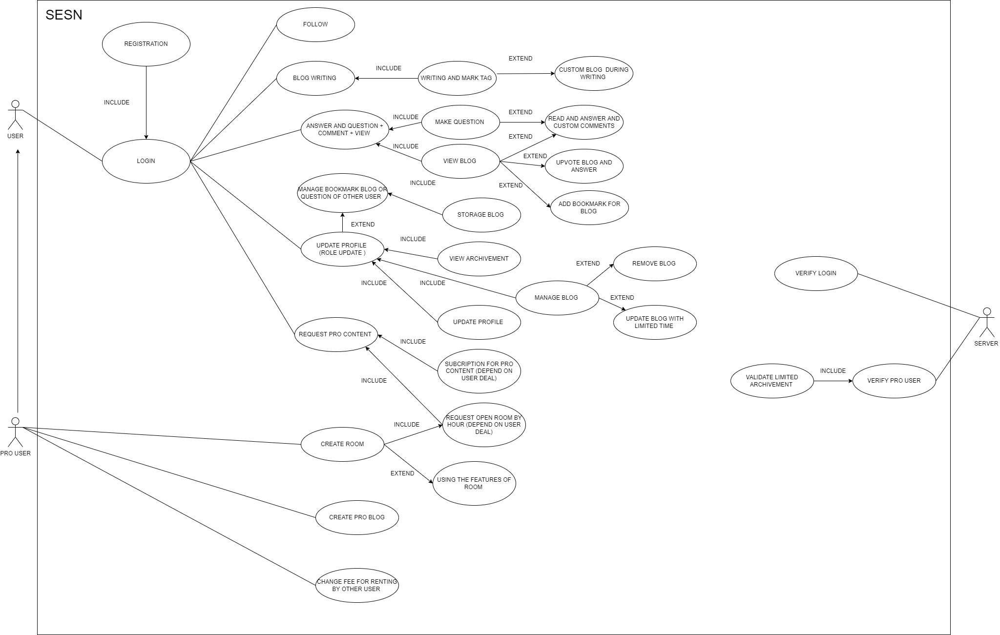

:star: # HACKATHON 2022 - UNIHACK - SMART EDUCATION SOCIAL NETWORK
---
:smirk: ## STRUCTURE OF BRANCHES OF TEAM
| MEMBER      | POSITION | BRANCH     | 
| :---        |    :----:   |          ---: |
| Nhan      | LEADER + BE DEV + PRESENTATION + BA      | Nhan + BE + main    |
| XeusNguyen   | BE DEV + PM + BA        | Xeus + BE + main      |
| Duyen | FE DEV + BA | Duyen + FE + main |
| Tien | FE DEV | Tien + FE + main |
| Nghia| FULL STACK + BA + PRESENTATION | Nghia + BE + FE + main |
---
# THE FIRST SIGHT INTO THE PROJECT. LOOK USE CASE AND WE CAN COVER WHAT WE CAN DO FO THIS

